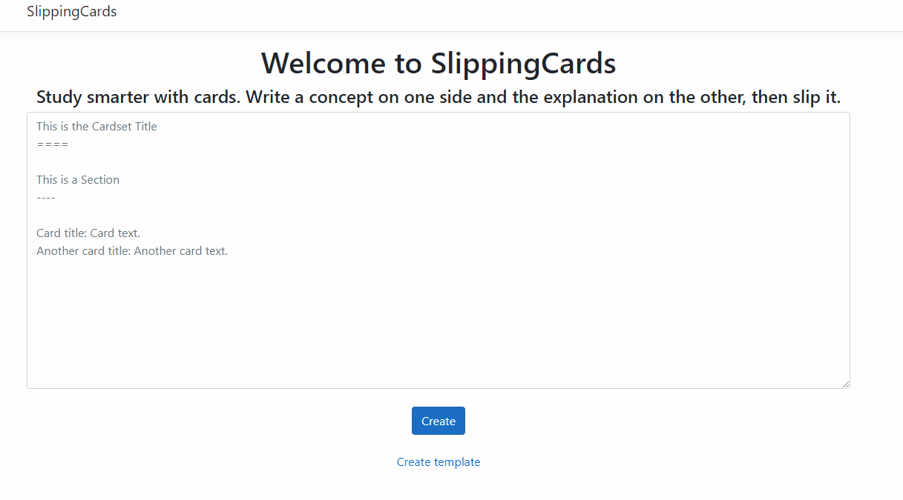

# SlippingCards

Study smarter with cards. Write a concept on one side and the explanation on the other, then slip it.

You can host this on your own server or just use it on cards.izzitech.com.ar



## Roadmap

- [ ] Load text cardset and display them.
- [ ] Allow users to create an account and save cardset.
- [ ] Show a card from a specific cardset at random.
- [ ] Javascript UI to create cards graphically and rearrange them dynamically.
- [ ] Let users upload pictures for cards.

## How does it work

You can load a text with the folowing format:

``` 
Cardset Title
=============

Section Title
-------------
Card title: Card text.
Another card title: Another card text.
```

There is a template named SlippingCards_template.txt inside this repo.

Hyphens and equal signs should be at least 4 characters.
